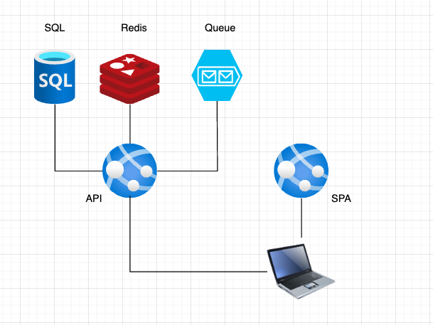

# What is .Net Aspire
Dotnet aspire is opinionated distributed application development framework.

# What we are going to do
We are going to build a dummy app with dotnet, angular, sql database, redis and service bus without using aspire. 

# What will we use
- `dotnet` cli
- `npm` cli to install `ng` to generate `angular` project
- `docker-compose` to run redis, sql and servicebus
- multiple terminal window to run app
- hard to debug

# What will Aspire help us with
- bootstrapping running app locally
- observability
- connection strings and secrets
